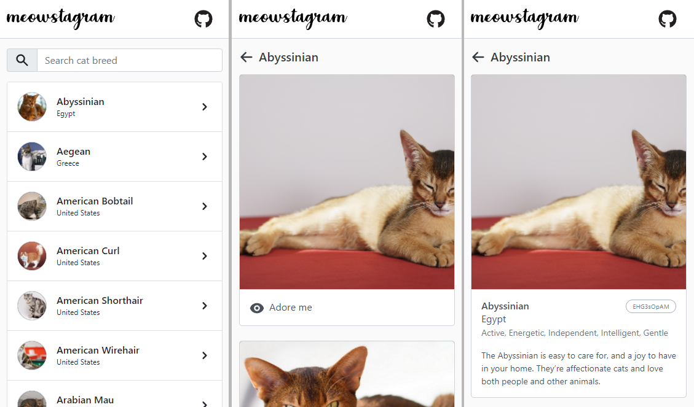

# Coding Exercise for IONA

## Libraries used
- [x] react-router-dom
- [x] react-bootstrap
- [x] axios
- [x] axios-cache-adapter
- [x] react-redux / redux-toolkit
- [x] node-sass
- [x] lodash
- [x] eslint
- [x] heroicons

## More Features
- Crisp high quality SVG icons.
- Cache the api request to improve the efficiency of data retrieval. It also improves user experience.
- API spec test file `catsSlice.spec.js` to demo `jest`.

## Layout improvements
- Displayed cat breed list as an instagram profile styled list rather than a plane `select`.
- Added a search to breed list.
- Changed some labels to be more playful, `View details` to `Adore me` and `Load more` to `Click for more cats`.
